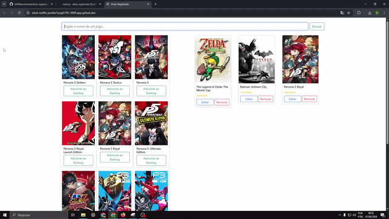

<h1 align="center">Atrás Registrado</h1>

 
  

  
  
  
  
  
  
  

>Status do Projeto ⚠️ (Em desenvolvimento).

### Tópicos

🔹 [Descrição do projeto](#descrição-do-projeto)

🔹 [Funcionalidades](#funcionalidades)

🔹 [Deploy da Aplicação](#deploy-da-aplicação)

🔹 [Pré-requisitos](#pré-requisitos)

🔹 [Como rodar a aplicação](#como-rodar-a-aplicação)

🔹 [Padrão de commits e branches](#padrão-de-commits-e-branches)

🔹 [Linguagens, dependências e libs utilizadas](#linguagens-dependências-e-libs-utilizadas)

## Descrição do projeto 

  O Atrás Registrado é a tentativa de clonar algumas funções do website <a href="https://backloggd.com/" target="_blank">Backloggd</a>, é um pequeno projeto para apresentação para a minha aula de Sistemas Web, ele vai ser feito com HTML, CSS (Boostrap), JavaScript, Express, Node.JS.

## Funcionalidades

🟩 Lista todos os jogos adicionados 

🟩 Adiciona um jogo à sua lista  

🟩 Edita um jogo que você adicionou  

🟩 Remove um jogo que você adicionou 

## Deploy da aplicação

  

## Pré-requisitos

- HTML5 / CSS3 / Bootstrap 5
- JavaScript (Manipulação de DOM e Fetch API)
- Node.js & Express

## Como rodar a aplicação

...

## Padrão de commits e branches

Como é um projeto pequeno, não gostaria de ficar me embolando em organização de branches e padrão de commits, então fui bem simplista nessa etapa:

### Branches

Serão branches de apenas dois níveis, a `main` como principal e as outras duas como filhas:

✅ `main`: Nessa branch só entra o código final, tentarei ao máximo não upar código diretamente.

🔧 `fix`: Branch para consertar algum bug ou corrigir algo.

➕ `feat`: Quando alguma funcionalidade, dependência ou algo novo for desenvolvido / adicionado.

### Commits

Vão ser apenas 3 prefixos para os commits:

🔧 `fix` Quando for corrigido algum bug ou erro de digitação.

➕ `feat` Quando alguma funcionalidade, dependência ou algo novo for desenvolvido / adicionado.

📰 `docs` Para alterações no `README.md`.

## Linguagens, dependências e libs utilizadas

- [Express](https://www.npmjs.com/package/express)
- [nodemon](https://www.npmjs.com/package/nodemon)
- [dotenv](https://www.npmjs.com/package/dotenv)

